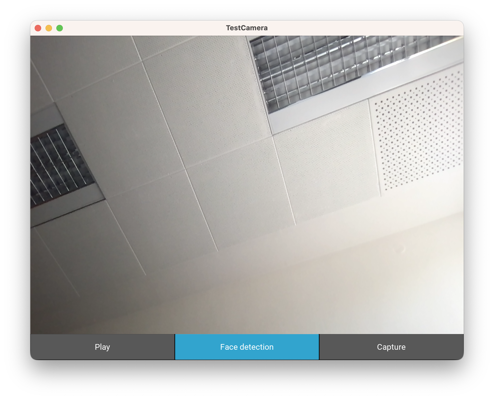

# KivyFaceRecognition


This repository contains a simple example application to demonstrate realtime face detection and recognition for the default [Kivy](https://github.com/kivy/kivy) [camera class](https://kivy.org/docs/api-kivy.uix.camera.html) by using the following additional libraries:    
- [numpy](https://github.com/numpy/numpy)    
- [pillow](https://github.com/python-pillow/Pillow)    
- [face_recognition](https://github.com/ageitgey/face_recognition)    

You should replace the `Test.png` file with a file of a person you want to identify. You can register multiple persons by adding additional `register` calls to main.py.

``` Python
camera.register_person("NAME", "file.png")
```
When you run the `main.py` you should be presented with a UI looking like this: 



Detected faces will be surrounded by a red border that contains a label below it with the name of the person or `Unknown`, if no name is registered for the detected face.